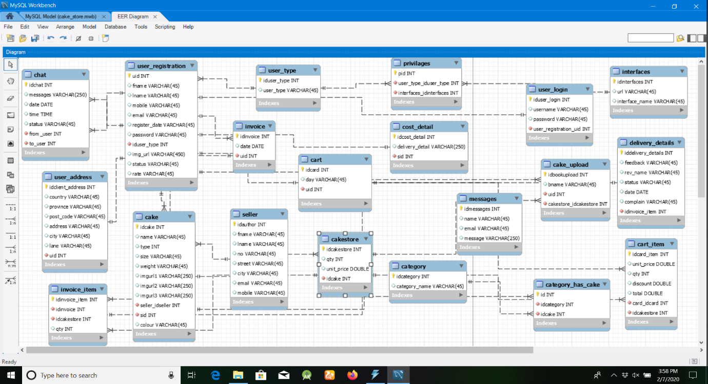
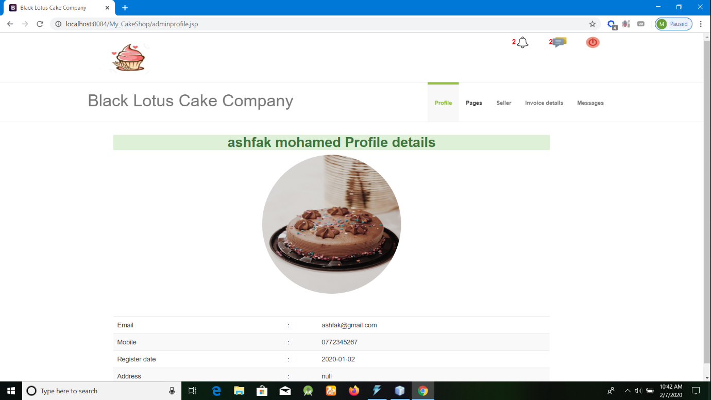
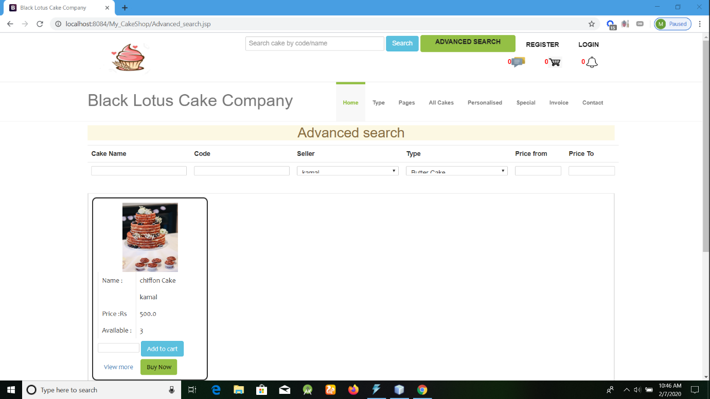
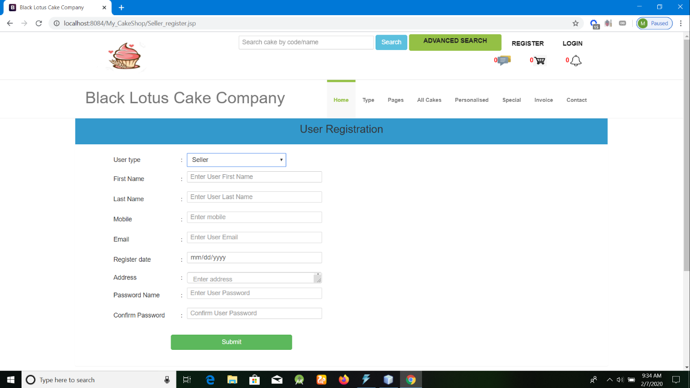
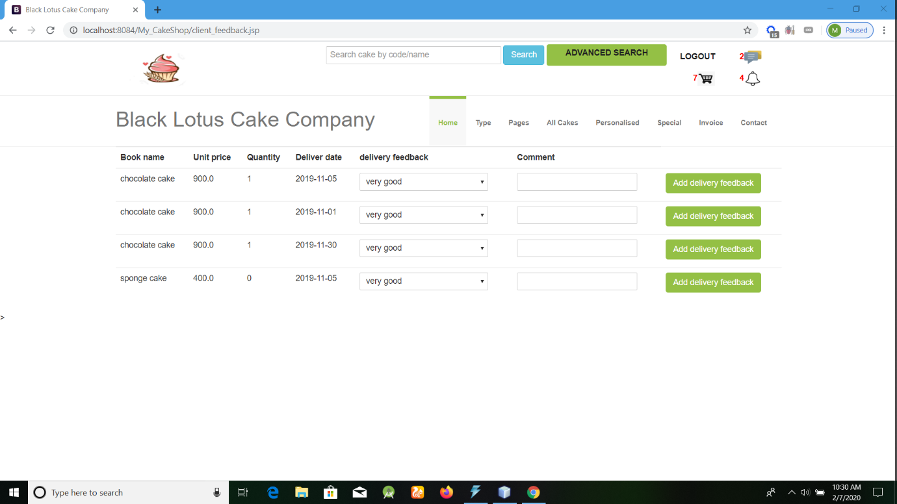

# Sales-and-Stock-Management-System
An automation web system in Java EE to store products’ specifications and track stock through purchase and sale operations for cake online supplier company.

# Features 
*	Login for admin, seller and customer 
*	Admin can add new seller and other vendors
*	Admin can edit seller and customer Information
*	Admin can add, edit and delete Products
*	Sellers can sell products* 
* Customer can check products and view own purchase history

# Used Tools:
* NetBeans 8.2
*	MySQL Query Browser
*	Workbench 

# Er Diagram

# User Interfaces

 

 

 

